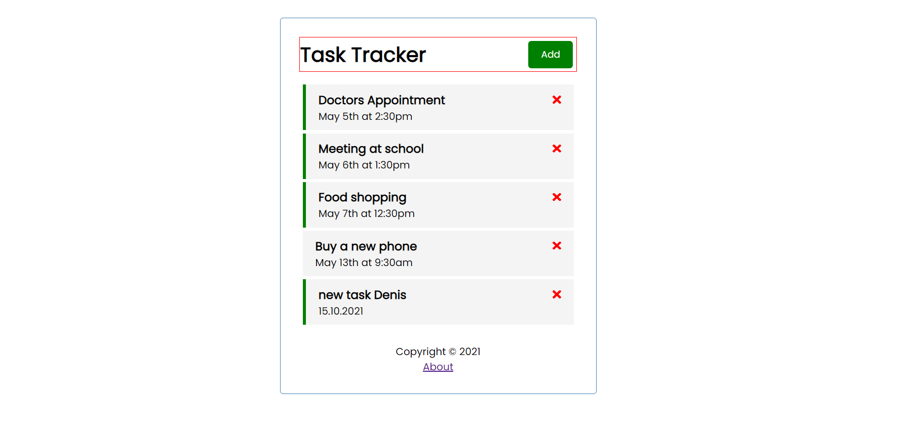
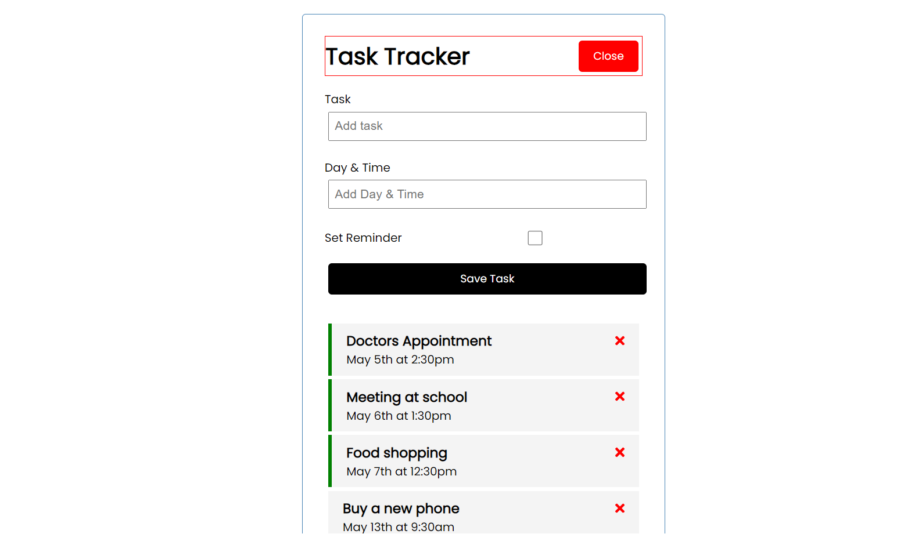
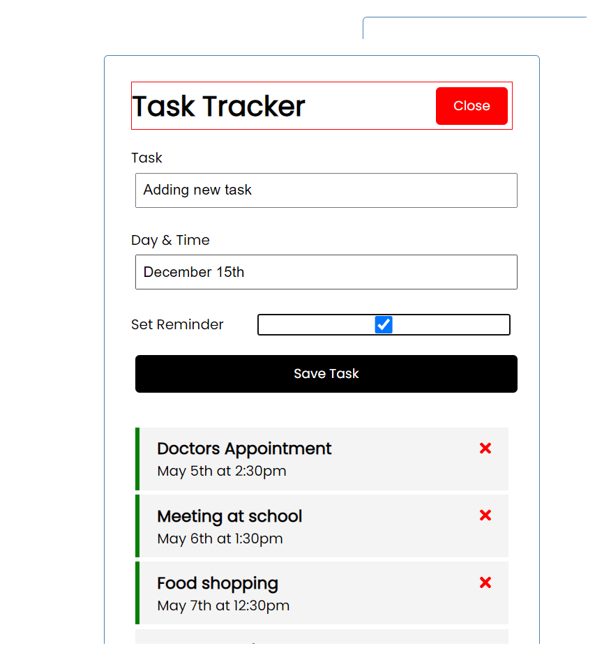

# TaskReminderApp

#### Simple web application made with Angular. User can see his list of tasks and perform all CRUD operations with them.
 

# App startup
 

#### Download the github repository
#### Go inside that directory and run npm install
#### Run npm start or ng serve to start the app on localhost/4200

# Images
 

  
      
  
